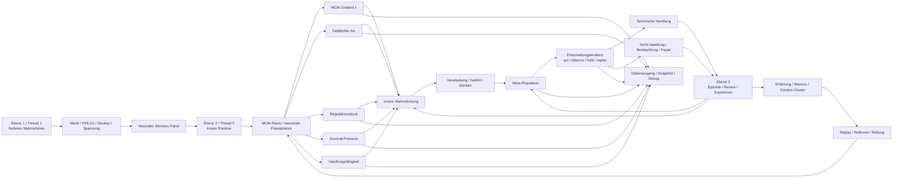

# MCM Trading Brain


MCM Trading Brain ist ein experimentelles Trading-System mit MCM-Architektur.

Ziel ist nicht ein klassischer Bot mit starren Regeln, sondern ein System, das:

- äußere Marktverhältnisse wahrnimmt
- diese intern verarbeitet
- daraus Handlungstendenzen bildet
- und sich über Erfahrung weiterentwickelt

Die Zielarchitektur orientiert sich deshalb nicht nur an einem technischen Ablauf, sondern an drei funktionalen Ebenen:

- **Ebene 1:** sehen / äußeres Wahrnehmen
- **Ebene 2:** denken / inneres Wahrnehmen / Handeln
- **Ebene 3:** Entwicklung aus Erfahrung / Verarbeitung / Wahrnehmung

---

## Aktueller Implementierungsstand

Das System ist nicht mehr nur konzeptionell.

Bereits real im Code vorhanden sind:

- Wahrnehmungsschicht aus OHLC-Daten
- laufende MCM-Runtime
- Entscheidungstendenz (`act / observe / hold / replan`)
- technische Handelsbahn
- Episode-, Review- und Experience-System
- persistenter Memory-State

Das Projekt befindet sich damit im **Architektur-Endausbau** und nicht mehr in einer frühen Basisphase.

---

## Grundrichtung des Systems

Die Architektur soll sich strukturell an einem menschlicheren Entscheidungs- und Wahrnehmungsprozess orientieren.

Das bedeutet:

- Außenwelt und Innenwelt sind getrennt
- äußere Reize werden nicht direkt zu Regeln oder Orders
- der innere Zustand ist nicht nur Nebenprodukt, sondern Architekturzentrum
- Erfahrung verändert langfristig Wahrnehmung, Regulation und Handlung
- das System bewertet Situationen nach Tragfähigkeit, nicht nach bloßem Ergebnis

Das System soll nicht lernen, einfach immer weiter zu traden.
Das System soll lernen, **handlungsfähig zu bleiben**.

Lernen bedeutet in diesem Projekt daher nicht:

- möglichst oft richtig zu liegen
- möglichst aggressiv Profit zu maximieren

Sondern:

- mit Situationen effizient umgehen zu können
- bei geringer regulatorischer Last handlungsfähig zu bleiben
- tragfähige Handlung von hektischer Handlung zu unterscheiden

---

## Kernprinzip

**KI/Bot haben keine festen Gates oder starren Handelsregeln als Kernlogik.**

Das Ziel ist, dass sich Regeln, Präferenzen und regulatorische Reaktionen aus Erfahrung selbst herausbilden:

- Außenwelt erkennen: Markt, Struktur, Spannung, Bewegungscharakter
- Innenzustand verarbeiten: Druck, Konflikt, Reife, Bereitschaft, Erwartung, Regulationslast
- Trade-Versuche beobachten: auch Block, Cancel, Timeout, No-Fill, Nicht-Handlung
- Outcomes und Denkverläufe rückkoppeln
- daraus langfristig Wahrnehmung, Regulation und Handlung verändern

Das System bewertet dabei nicht primär:

- Profit
- Gewinnrate
- Drawdown

Sondern:

- Tragfähigkeit einer Situation
- Belastung und Entlastung
- Handlungsfähigkeit unter Reiz
- Kohärenz zwischen Innenzustand und Umwelt

Dadurch soll der Bot mit der Zeit überwiegend dort handeln, wo der Kontext tragfähig ist, statt durch harte if/else-Regeln gesteuert zu sein.

---

## Runtime-Flow

Der reale Ablauf des Systems ist:

```text
Market Window (OHLC)
→ candle_state
→ tension_state
→ visual_market_state
→ structure_perception_state

→ MCM Runtime
→ innerer Zustandsraum
→ decision_tendency
    - act
    - observe
    - hold
    - replan

→ technische Umsetzung
    - Trade
    - oder Nicht-Handlung

→ Episode
→ Review
→ Experience Update
```

Wichtig:

- Entscheidung ist **nicht automatisch** ein Trade
- Nicht-Handlung ist ein echter Teil des Systems
- Review und Experience werden auch bei Nicht-Handlung weitergeführt

---


--------------------------------------------------
## Architektur auf einen Blick


--------------------------------------------------

## Zielarchitektur

```text
Ebene 1: sehen / äußeres Wahrnehmen
  -> OHLC/Marktdaten
  -> candle_state
  -> tension_state
  -> visual_market_state
  -> structure_perception_state
  -> neutrales Stimulus-/Informationspaket

Ebene 2: denken / inneres Wahrnehmen / Handeln
  -> outer_visual_perception_state
  -> inner_field_perception_state
  -> perception_state
  -> processing_state
  -> felt_state
  -> thought_state
  -> meta_regulation_state
  -> expectation_state
  -> decision tendency
  -> technische Handlung oder Nicht-Handlung

Ebene 3: Entwicklung aus Erfahrung / Verarbeitung / Wahrnehmung
  -> decision_episode
  -> review
  -> outcome_decomposition
  -> experience_space
  -> signature_memory
  -> context_clusters
  -> adaptive Veränderung der Innenbahn
```

---

## MCM-Zustandsraum

Das System arbeitet mit einem expliziten Zustandsraum.

Wichtige Zustandsachsen sind:

- `field_density`
- `field_stability`
- `regulatory_load`
- `action_capacity`
- `recovery_need`
- `survival_pressure`

Diese Größen bestimmen nicht direkt eine Order,
sondern die **Tragfähigkeit von Handlung**.

---

## Decision ≠ Trade

Wichtig für das Verständnis:

- Entscheidung = innere Tendenz
- Trade = technische optionale Umsetzung

Das System kann bewusst:

- handeln
- beobachten
- halten
- replannen
- nicht handeln

Nicht-Handlung ist daher kein Fehler,
sondern ein valider Teil regulatorischer Stabilität.

---

## Experience-System

Das System lernt nicht nur aus Exit-Ergebnissen.

Es lernt aus:

- Wahrnehmung
- Zustandsverlauf
- Entscheidungsweg
- Nicht-Handlung
- Episode und Review
- Kontext und Cluster

Technisch besteht diese Ebene unter anderem aus:

- `decision_episode`
- `review`
- `outcome_decomposition`
- `experience_space`
- `signature_memory`
- `context_clusters`
- Similarity-Achsen
- Drift / Reinforcement / Attenuation

Lernen bedeutet hier:

- bessere Umgangsfähigkeit mit Situationen
- bessere Tragfähigkeit unter Reiz
- stabilere Entscheidung unter regulatorischer Last

---

## Systemerweiterung

Die aktuelle Erweiterungsrichtung ist klar:

Nicht nur einzelne Signale oder Outcomes sollen bewertet werden,
sondern der **gesamte laufende Zustandsraum des MCM-Systems**.

Dazu gehört:

- explizite Wiedergabe des MCM-Raums als laufender Innenzustand
- Felddichte als Ausdruck der Verdichtung des Gesamtfeldes
- regulatorische Last als Ausdruck von innerem Druck und Instabilität
- Survival-Pressure als Ausdruck von Überlast, Unsicherheit, Fehlserien und verminderter Tragfähigkeit
- Handlungsfähigkeit als Ergebnis von Regulation, Erholung und Feldstabilität

Diese Größen sollen **nicht** als starre Verbote eingebaut werden.
Sie sollen aus dem MCM-Raum selbst entstehen und die Entscheidungstendenz natürlich verschieben:

- hohe Verdichtung -> mehr Beobachtung / Pause / Sammlung
- sinkender Druck -> wieder mehr tragfähige Handlung
- positive Erfahrung -> Entlastung und Stabilisierung
- Fehlhandlungen -> Verdichtung, Unsicherheit, Rückzug in Beobachtung

Zusätzlich wird die Entwicklungsebene weiter geschärft:

- Lernen bedeutet Umgangsfähigkeit mit Situationen
- Erfahrungsräume werden als Cluster ähnlicher Struktur-Zustands-Wirkungen verstanden
- Outcome wirkt nicht primär als Geldzahl, sondern als Zustandsveränderung
- Kohärenz reduziert regulatorische Last und Energieverbrauch
- Profit ist nicht das Ziel des Systems, sondern ein mögliches Nebenprodukt stabiler Kohärenz

---

## Value Gate

Das Value Gate ist **kein Entscheidungsmodul**.

Es prüft nur technische Mindestbedingungen wie:

- Preisgeometrie
- Risiko
- Reward
- RR

Es ist damit eine technische Absicherung,
nicht die eigentliche Denklogik des Systems.

---

## Was das System nicht ist

Das System ist nicht:

- kein klassischer Signal-Bot
- kein starres Regelwerk
- kein klassischer RL-Agent
- kein PnL-Optimierer
- kein Trade-Ausführer ohne Innenzustand

---

## Setup

```bash
pip install -r requirements.txt
```

Start über:

```bash
python runner.py
```

Der Modus wird in `config.py` gesetzt (`BACKTEST` oder `LIVE`).

---

## Zusammenfassung

Das System tradet nicht einfach.

Es nimmt wahr,
verarbeitet,
reguliert,
entscheidet
und manchmal entsteht daraus ein Trade.
